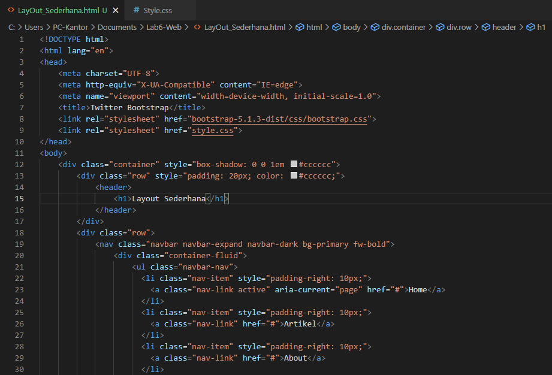

# Lab6-Web

Nama : M. Aqil Al Farid 
NIM : 312010140 
Kelas : TI.20.B.1 

# TUGAS

 
Pada gambar di atas adalah keterangan tugas pada pratikum Lab6 

# PENGERJAAN

1. Hal pertama yang harus kalian lakukan adalah membuat folder Lab6Web didalamnya harus terdapat 2 folder lagi yaitu Pictures untuk menyimpan gambar atau hasil screenshot dan Lab6_css_framework untuk folder bootstrap, html, dan cssnya.
2. Selanjutnya mendownload bootstrap di getbootstrap.com
3. Setelah kalian download kalian extract rar atau zipnya, Setelah kalian extract pindahkan folder bootstrap kedalam Lab6_css_framework yang tadi kita buat.
4. Setelah semua sudah siap , saatnya kita mulai codingan HTML dan CSS nya.

### Berikut hasil CODINGAN HTML 

 
 
 
 

Bila sudah selesai di ikuti , kita lanjut pengerjaan CSS nya. 

### Pengerjaan Codingan CSS

 

Selesai tahapan codingan HTML & CSS. Lanjut sekarang hasil dari codingannya , maka akan muncul seperti Gambar tugas. 

 
 

Sekian dari saya , Terima kasih.
